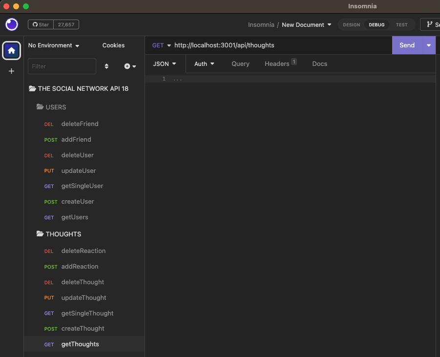
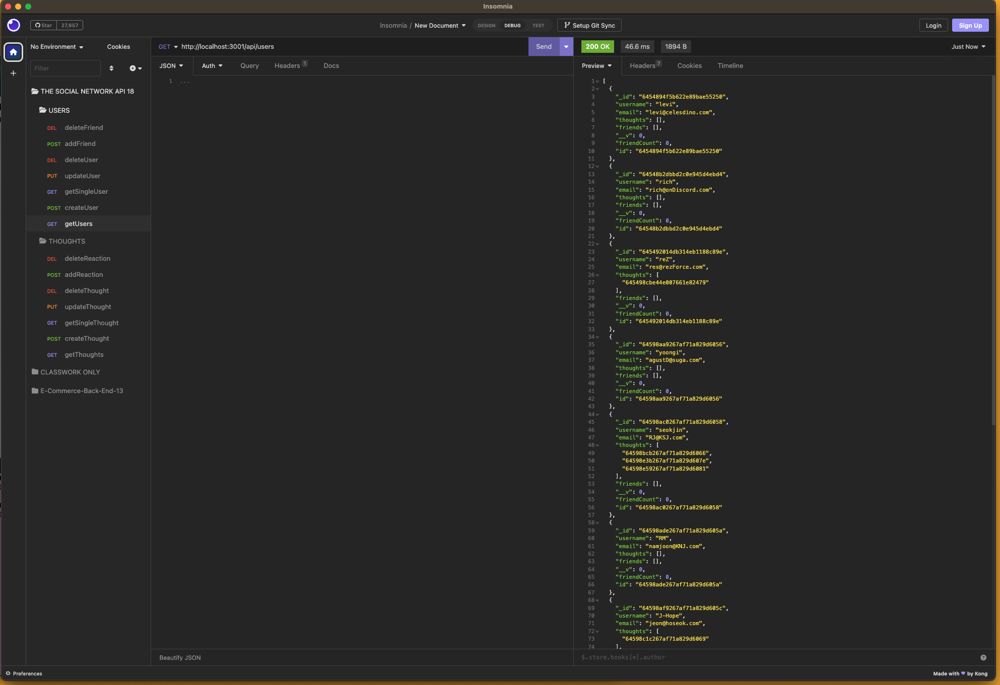
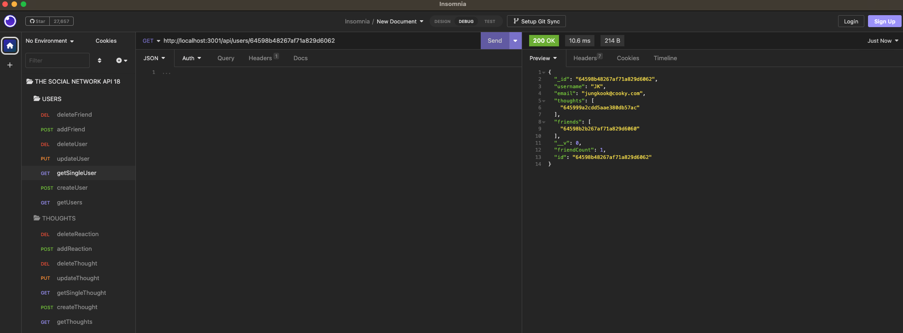

# THE-SOCIAL-NETWORK-API-18

## Description

The Social Network API is a project to demonstrate the use of MongoDB as a popular choice for social networks due to its speed with large amounts of data and flexibility with unstructured data.  This solves the problem when social networks are presented with large amounts of data from its users. 

This NoSQL challenge was motivated by taking on the user story role of:
"AS a social media startup
I want an API for my social network that uses a NoSQL database
SO THAT my website can handle large amounts of unstructured data." 

To do so, I first implemented what I learned using Express.js, MongoDB, and Mongoose ODM to create an API for social network web applications where users can share their thoughts, react to friends' thoughts, and create a friend list.  By creating this social network API I was able to apply my knowledge and understanding using MongoDB as my database, Mongoose for the models to sync to the MongoDB , and express to handle the URL routes for requests.  

## Installation

This project requires the following dependencies to be installed:

express^4.18.2
mongoose^7.1.0

To install node_modules begin by running the command 'npm i init -y'.
Then run 'npm i mongoose' to install Mongoose and 'npm i express' to install Express. 

## Usage

PLEASE FIND DEMO VIDEO CONTAINED IN THIS LINK HERE: https://drive.google.com/file/d/1Sbac_gR3F3quNGMb332t_IBYLpVRn_bV/view

Steps to running the application: 
1. To start the sever run 'node index.js' in the terminal.  
2. Use Insomnia to send requests to the server to test routes for the MongoDB models: 'Thought', 'User', and Schema for 'Reaction'.

Routes for interacting with each of the models: 

1. GET all users / all thoughts
"GET/api/users" gets all users with their user id, username, email, thoughts by id, friends by id, and friend count. 

2. GET single user / single thought
"GET/api/users:userId" gets a single user with their user id, username, email, thoughts by id, friends by id, and friend count.

3. POST / PUT / DELETE users / thoughts 
4. POST / DELETE friends (of user)
5. POST / DELETE reactions (of thoughts)

## Credits

I would like to give credit to my tutors Bobbi Tarkany and Ryan Fernandez for their direction and encouragement while I worked through this project.  

Stack Overflow was used for reference to validating an email regex:
https://stackoverflow.com/questions/18022365/mongoose-validate-email-syntax

MDN Docs was used for reference to adding a Date with the 'toLocale'
Date String:
https://developer.mozilla.org/en-US/docs/Web/JavaScript/Reference/Global_Objects/Date/toLocaleDateString

I also credit Michael Huang, Emma Daily, and Michael Radar for working with me as we shared code and worked through this project side-by-side, troubleshooting and testing.  

## License
N/A

## Questions

If you have any questions please feel free to contact me at pkfalberto@gmail.com or visit my GitHub at https://github.com/P-Trish/THE-SOCIAL-NETWORK-API-18.  

